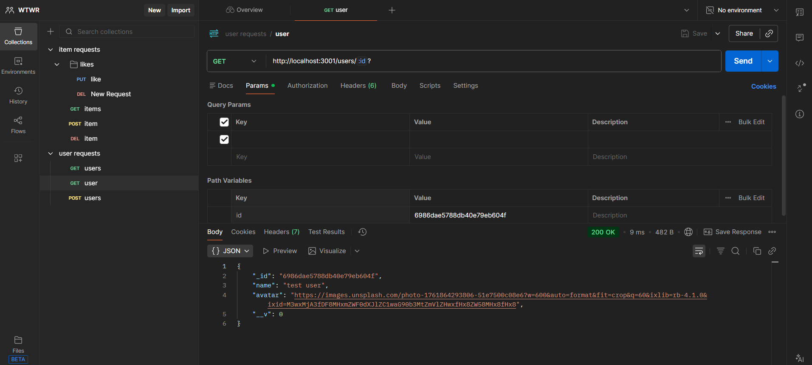
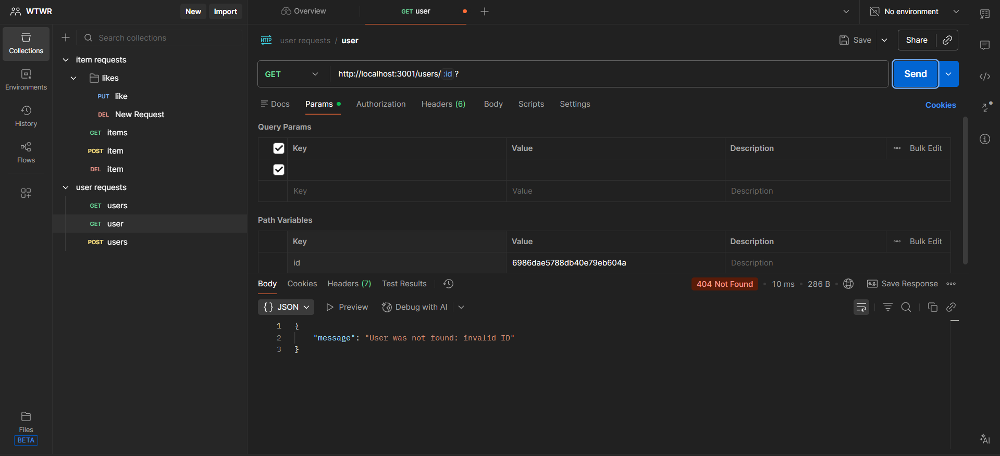
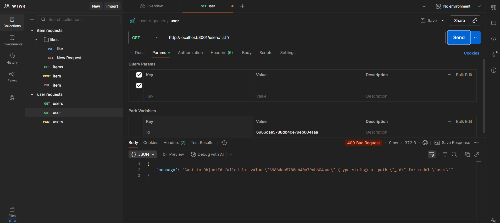

# WTWR (What to Wear?): Back End

Creates a server for the WTWR application use and connects it to a database

# Technologies:

- node.js
- express.js
- mongoDB
- mongoose
- eslint

# Images:

# video pitch:

- [Google Drive Link](https://drive.google.com/file/d/1HH5-BEneGcoWoMjTje2s4gnIE3aeKVBQ/view?usp=drive_link)
- [YouTube Link](https://youtu.be/bQjtnc0gl_8)
