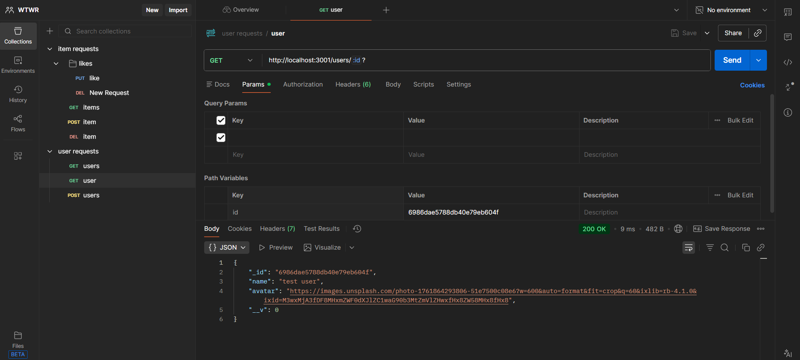
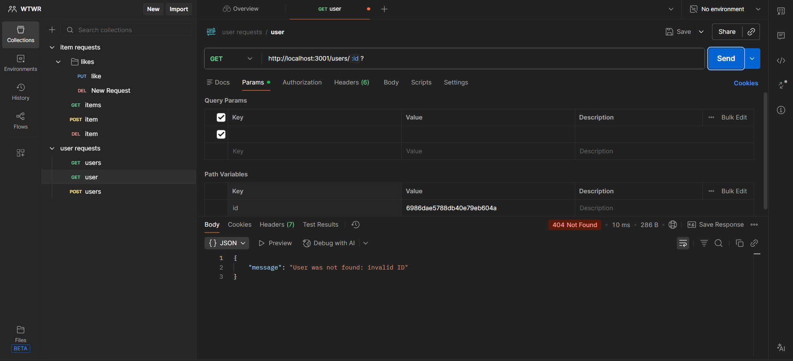
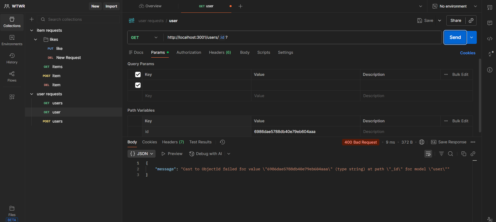

# WTWR (What to Wear?): Back End

Creates a server for the WTWR application use and connects it to a database

# Technologies:

- node.js
- express.js
- mongoDB
- mongoose
- eslint

# Images:

# video pitch:

## YouTube:

- [WTWR part 3](https://youtu.be/bQjtnc0gl_8)

- [WTWR part 4](https://youtu.be/CYwdu3ua9zk)

## Google Drive:

- [WTWR part 3](https://drive.google.com/file/d/1HH5-BEneGcoWoMjTje2s4gnIE3aeKVBQ/view?usp=drive_link)

- [WTWR part 4](https://drive.google.com/file/d/1VhI_4nKmfaExDZepNWVkI5pJhiaomYz-/view?usp=drive_link)

# Front End Repository:

- [WTWR Front End Repository](https://github.com/Rose-2357/se_project_react)

# Deployed project:

- [WTWR Deployed Project](https://rose-ghaffari-wtwr.privatedns.org/)
